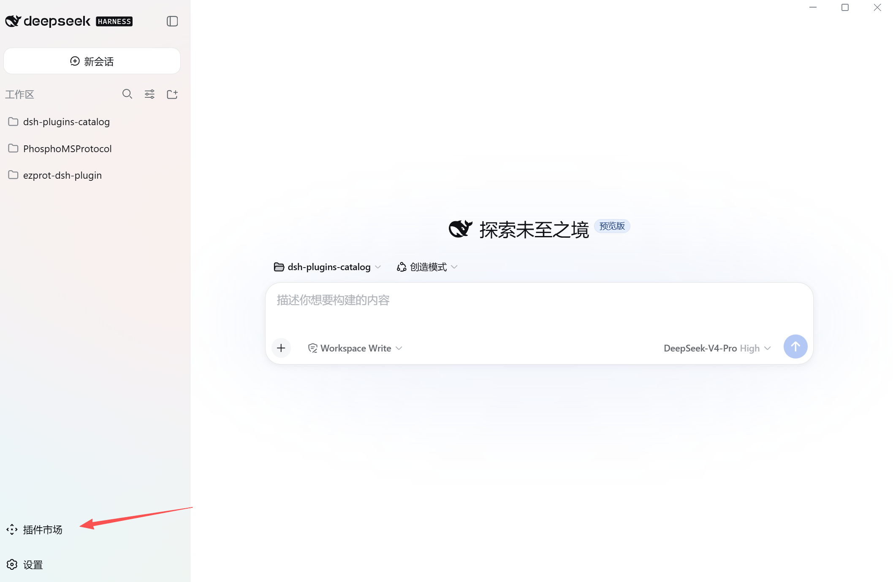
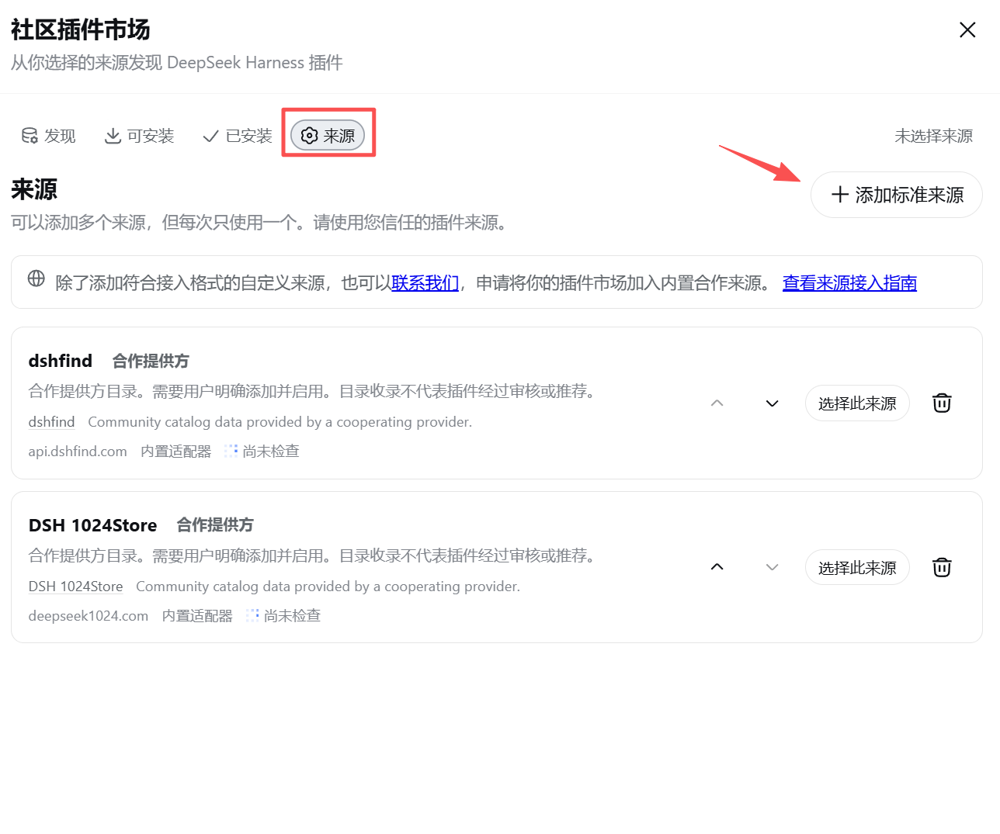
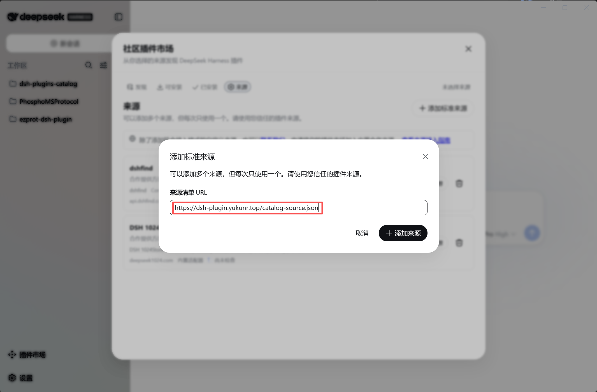

# Installation guide (add the catalog source)

[English](install.md) | [中文](install.zh.md)

This guide shows how to add the YukunR plugin catalog source in [**DSH Desktop**](https://github.com/anywhere-labs/deepseek-harness-desktop#dsh-desktop) via the built-in plugin market. Add this one source and every plugin in this catalog (currently `dsh-ezprot-plugin`) appears under **Discover** and **Installable**. Everything is done in the GUI — no terminal needed.

## Prerequisites

- DSH Desktop installed (bundles Node.js and pnpm);
- Network access to `dsh-plugin.yukunr.top`.

## Steps

### Step 1: Open Settings → Plugins

Launch DSH Desktop and go to **Settings → Plugins**.



### Step 2: Open the market's Sources view

In the Plugins page, find the **Plugin market** tab and switch to the **Sources** view.



### Step 3: Add a standard source

Click **Add standard source** and paste the catalog URL:

```
https://dsh-plugin.yukunr.top/catalog-source.json
```

Confirm, and the source appears in the source list.



## After adding

Switch back to the **Installable** view to see every plugin in this catalog (currently `dsh-ezprot-plugin`). Click a card to install; restart DSH Desktop after installing so the new plugin is loaded.

## Troubleshooting

| Symptom | Fix |
|---|---|
| Adding the source fails | Check network access to `dsh-plugin.yukunr.top`; make sure system IPv6 is available (the Desktop client pins the first resolved address for self-hosted sources) |
| No plugins in Discover / Installable | Make sure the source is selected; refresh the Sources page and retry |
| Tools don't appear after install | Restart Desktop to load the new bundle; confirm it installed into the currently active profile |
